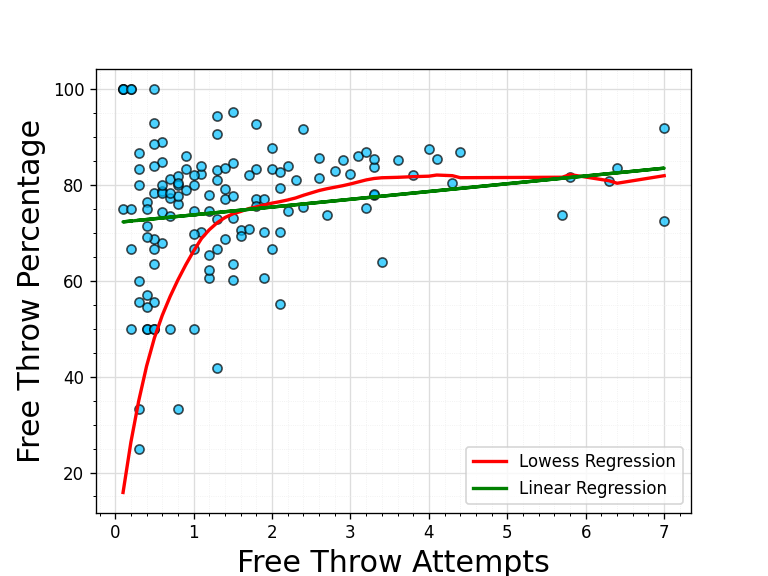

# An In-Depth Explanation of Localized Weighted Regression, with a Python Class Implementation


##### *by Jimmy Bach*


## The Theory

What is Localized Weighted Regression, otherwise known as Lowess? In essence, Lowess calculates the expected value of the conditional expectation of an output <em>y</em> given that a certain input <em>X</em> is equal to a specific x value (Eq. 1). Although Lowess does in many cases utilize linear regression and its regularized offsets (ex: Ridge) at a local level, it contrasts from these forms of regression and is considered <strong>non-parametric</strong> because we cannot make any assumptions about the relationship between input and output at a global scale within the dataset. 
$$
\mathbb{E}[y|x=x]=f(x),\text{the conditional expectation formula fundamental to Lowess}
$$


Besides an input and output, Lowess also takes 2 additional things into account- a <em>kernel function</em> and a <em>tau value</em>.

<div style="font-size: large;"><strong>Definitions</strong></div>
<strong>Kernel Function:</strong> A Kernel function is a function bound by specific values and 0 otherwise. Typically, kernel functions have a local maximum in the middle of the support window and taper towards 0 on the edges. One example is a Gaussian (normal) distribution bounded on each side (Eq.2).

<strong>Tau:</strong> The Tau value, otherwise known as the <em>bandwidth</em>, helps set a restriction on what the weight values for your inputs can be.

In conjunction with each other, a kernel and bandwidth help create a matrix of weights. These weights are calculated by taking the distance between one set of points and another, point by point. In practice (and especially in machine learning), this is often a training set and test set of your inputs. The distance values, after being divided by the tau (hence restricting the <strong>bandwidth</strong>), are inputted into the kernel. The local maximum of a kernel function represents points 0 units apart (i.e. the same point) and will produce higher weights, with larger distances (less similar points) tapering off in weight values as they're either on the edge or out of the bounds of the kernel (which reduces the weight to 0).
$$
K(x):= e^{-\frac{\|x\|^2}{2\tau}}, \text{the Gaussian kernel}
$$


The weights reinforce the idea that we are looking for <strong>local</strong>, not global, relationships. A training point that has input values similar to a testing point's input values is likely to have a strong ability to predict the test point's output. This is the case in basic regressions such as linear regression as well, but the key difference there is that if our X and y present a non-linear relationship, linear regression fails because it attempts to treat every point as equally important to establishing a prediction for a specific point. Instead, we can utilize linear regression within Lowess by fitting our weighted data to a linear model. This approach leads to a set of different linear relationships throughout the data that can approximate an overall non-linear relationship, rather than simply one "line of best fit". It's also for this reason that we begin to see a smoothing effect in Lowess models. The example below of NBA Free Throw Attempts vs. Percentage during the 2023-24 season, in which the relationship is roughly equal to 
$$
y= -\frac{1}{x}+80
$$
which is clearly non-linear, does a good job of showing how Lowess can overcome the shortcomings of a linear model and adjust to the relationship present in a model, and how it adjusts to slight variations in an overall relationship depending on the value of the features.




That's the theory behind Lowess, here's the code!


## A Lowess Class


### Required imports

```python
import numpy as np
import pandas as pd
from sklearn.preprocessing import StandardScaler
from scipy.spatial.distance import cdist
from sklearn.linear_model import Ridge
from sklearn.model_selection import KFold
from sklearn.metrics import mean_squared_error as mse
from sklearn.model_selection import ParameterGrid
```


### Initializing your model

```python
def __init__(self, kernel, tau=0.5):
        self.kernel = kernel
        self.tau = tau
```

To create an instance of your Lowess class, you need to first decide which kernel function and tau values you want. The base value of tau is a value value of 0.5.

Here are some kernel function examples:

```python
def tricubic(x):
  return np.where(np.abs(x)>1,0,(1-np.abs(x)**3)**3)

def Gaussian(x):
  return np.where(np.abs(x)>4,0,1/(np.sqrt(2*np.pi))*np.exp(-1/2*x**2))

def Epanechnikov(x):
  return np.where(np.abs(x)>1,0,3/4*(1-np.abs(x)**2))

def Quartic(x):
  return np.where(np.abs(x)>1,0,15/16*(1-np.abs(x)**2)**2)
```

Note that you must define these functions **before** this Lowess class. 


### Fitting the model to your selected feature(s) and target

```python
def fit(self, x, y):
      	ss=StandardScaler()
        self.xtrain_=ss.fit_transform(x)
        self.yhat_ = y.reshape(-1,1)
```

Since this class's intended purpose was to allow for Lowess implementation, the *fit* function's x and y parameters are meant to be the training sets of your features (x) and target (y). As you'll see in a later function in the class, the class has cross-validation capabilities that can handle the splitting of your data into training and testing sets internally. While not necessary for models where there is only one feature being used, the *fit* function takes time to scale the feature data. This is important for Lowess with multiple features to prevent one feature from exerting much more influence over distance calculations within weights than another.


### Predicting target outcomes for the test set

```python
def predict(self,x_new,model=Ridge(alpha=0.01)):
        check_is_fitted(self)
    		self.xtest_=ss.transform(x_new)
        w = self.kernel(cdist(self.xtrain_, self.xtest_, metric='euclidean')/(2*tau))

        local_model=model

        if np.isscalar(self.xtest_):
    			local_model.fit(np.diag(w)@(self.xtrain_.reshape(-1,1)),np.diag(w)@(self.yhat_.reshape(-1,1)))
          yest_test = local_model.predict([[self.xtrain_]])[0][0]
        else:
          n = len(self.xtest_)
          yest_test = np.zeros(n)
          for i in range(n):
            local_model.fit(np.diag(w[:,i])@(self.xtrain_),np.diag(w[:,i])@(self.yhat_.reshape(-1,1)))
            yest_test[i] = local_model.predict(self.xtest_[i].reshape(1,-1))
        return yest_test
```

This is a very involved function, so I'll take the time to break this down step-by-step.

1. First, we must double-check that the model has been fitted to training data before proceeding. Otherwise, the *predict* function will raise an error.
2. Once we can confirm that it has been fitted, we must transform the test feature values to fit the same scale that the train data values were on. 
3. Our next step is to calculate the weights, represented by *w*. This can be done by taking the pairwise Euclidean distance between our train and test sets, which are then restricted in value by dividing by *tau*. *w* will be an *i X j* matrix, with *i* being the length of our train set and *j* being the length of our test set. Our kernel function will give higher weights to points close to each other, and smaller (or zero) weights to points far apart.
4. We want to be able to model these local relationships between points, so the *model* parameter establishes what regression technique we wish to use at this level.
5. The conditional statement simply accounts for the scenario in which you only have one testing point. The code would look slightly different in this case because that changes *w* from a 2-D to a 1-D array, but the code within the if and else blocks functionally do the same thing, just at different dimensionality.
6. It's important to mention that each column within a 2-D weights matrix represents the weight given to each training point with respect to the same testing point. For example, *w[: , 1]* represents each training point's weight with respect to the first testing point. With that understanding, we can deduce from the code that we are essentially fitting a new model for each testing point and using it to predict the target value of only that testing point, leading to *n* different regression models being fitted, where *n* represents the length of the test set.
7. We want to fit the local model to the weights multiplied by the actual feature and target values of the train set. However, first, we must diagonalize our weights for that specific point. This is because matrix (or matrix/vector) multiplication requires the length of the second dimension of our weights matrix and the length of our first dimension of the training matrix (or vector) to be the same. Without diagonalization, this wouldn't be possible, as we're only using a column at a time of the weights matrix. This means that our column's second dimension has a value of **1**, while the length of our training matrix/vector is simply how many points are in the train set, which should be **>1**. Diagonalization transforms the weights column into a square matrix with the number of rows and columns equal to the length of the training set.
8. Finally, we predict each testing point one at a time using the model that was fit using the weights associated with pairwise distances of the training data to that point. Once we have all of our predictions for each point, the *predict* function of the class returns an array of predicted target values for the test inputs.


### A simple K-fold cross-validation function

```python
def do_Kfold(self, X, y, model=Ridge(alpha=0.01),k=10, random_state = 146):

  kf = KFold(n_splits=k, random_state = random_state, shuffle=True)

  test_scores = []

  for idxTrain, idxTest in kf.split(X):
      Xtrain = X[idxTrain, :]
      Xtest = X[idxTest, :]
      ytrain = y[idxTrain]
      ytest = y[idxTest]

      self.fit(Xtrain,ytrain)
      test_scores.append(mse(self.predict(Xtest,model=model),ytest))

  return np.mean(test_scores)
```

This function runs standard K-fold cross-validation on the data. It splits the data into *k* pairs of training and testing data, which can then be plugged into the aforementioned *fit* and *predict* functions to get our predicted target values. To check how well the model performs, the list *test_scores* will contain the mean squared error (Eq. 4) of the predictions and actual target values for each train/test split. The function returns the mean of the MSEs. The lower this result is, the better the model performs.
$$
MSE=\frac{1}{n}\sum_{i=1}^{n}(y_i-\hat{y}_i)^2
$$


### Descent Boosting

```python
     def descending_boost(self,y_test=None,is_predicted=False,num_iter=10,eta=1,
                          local_model=Ridge(alpha=0.01)):
      check_is_fitted(self)
      
      m1=loess(self.kernel,self.tau)
      m1.fit(x=self.xtrain_,y=self.yhat_.flatten())
      m1_predictions=m1.predict(self.xtrain_)

      residuals=self.yhat_.flatten()-m1_predictions
      m2=loess(self.kernel,self.tau)
      m2.fit(self.xtrain_,residuals)
      m2_predictions=m2.predict(self.xtrain_)
      test_predictions=m1.predict(self.xtest_)
      mean_squared_errors=[mse(test_predictions,ytest)]
      sign=1
      for i in range(num_iter):
        residuals=residuals-eta*m2_predictions
        m2.fit(self.xtrain_,residuals)
        m2_predictions=m2.predict(self.xtrain_)
        test_predictions+=sign*m2.predict(self.xtest_)
        mean_squared_errors.append(mse(test_predictions,ytest))
        if mean_squared_errors[-1]>mean_squared_errors[-2]:
          mean_squared_errors.append(mse(test_predictions,ytest))
          sign=-1
      return np.array(mean_squared_errors)

```

The *descending_boost* function works by first fitting an initial model on a training dataset and then making predictions with that model on the training set. Once you have the predictions for the first model,  a new model is trained on the training features and the residuals between the original target training values and the learning rate multiplied by the predictions. The new model is also predicted on the training data. For each iteration of the function, we take the MSE of the newest model predicted on the test data added with the first model predicted on the test data. If our mean squared error worsens at any point, the next iteration in the function will instead subtract the new model's predictions, and switch between subtraction and addition until the MSE descends again.

*descending_boost* takes in two hyperparameters *eta*, which is the learning rate, and *num_iter*, which is the number of times we attempt to boost the function to decrease the MSE.

### Grid Searching to Optimize Hyperparameters

```python
def grid_search(self,param_grid={'alpha':[0.01]}, main_local_model=Ridge(),y_test):
      check_is_fitted(self)
      hyperparams=list(param_grid.keys())
      
      grid=ParameterGrid(param_grid)
      results=pd.DataFrame(columns=list(grid[0].keys()))
      for i in range(len(grid)):
        results.loc[results.shape[0]]=grid[i].values()
      
      local_param_grid=param_grid
      for h in hyperparams:
        if h in ['num_iter','eta','kernel','tau']:
          local_param_grid={key: val for key, val in local_param_grid.items() if key != h}
      
      loess_models=[]
      if ('kernel' in hyperparams) & ('tau' in hyperparams):
        for k in param_grid['kernel']:
          for t in param_grid['tau']:
            loess_models.append([k,t])
      
      elif 'kernel' in hyperparams:
        for k in param_grid['kernel']:
          loess_models.append([k,self.tau])
      
      elif 'tau' in hyperparams:
        for t in param_grid['tau']:
          loess_models.append([self.kernel,t])
      
      else:
        loess_models.append([self.kernel,self.tau])
      
      local_models=ParameterGrid(local_param_grid)

      mses=[]
      
      grid=ParameterGrid(param_grid)
      cols=hyperparams
      cols.append('mse')
      results=pd.DataFrame(columns=cols)

      if ('eta' in hyperparams) & ('num_iter' in hyperparams):
        for lm in loess_models:
          for e in param_grid['eta']:
            for i in param_grid['num_iter']:
              model=loess(lm[0],lm[1])
              model.fit(self.xtrain_,self.yhat_.flatten())
              model.xtest_=self.xtest_
              for local in local_models:
                MSE=model.descending_boost(y_test=y_test,is_predicted=True,num_iter=i,
                                         eta=e,local_model=main_local_model.set_params(**local))[-1]
                
                local['kernel']=lm[0]
                local['tau']=lm[1]
                local['num_iter']=i
                local['eta']=e
                local['mse']=MSE
                results.loc[results.shape[0]]=local


      elif 'eta' in hyperparams:
        for lm in loess_models:
          for e in param_grid['eta']:
            model=loess(lm[0],lm[1])
            model.fit(self.xtrain_,self.yhat_.flatten())
            model.xtest_=self.xtest_
            for local in local_models:
              MSE=model.descending_boost(y_test=y_test,is_predicted=True,num_iter=10,
                                       eta=e,local_model=main_local_model.set_params(**local))[-1]
              
              local['kernel']=lm[0]
              local['tau']=lm[1]
              local['eta']=e
              local['mse']=MSE
              results.loc[results.shape[0]]=local

      elif 'num_iter' in hyperparams:
        for lm in loess_models:
          for i in param_grid['num_iter']:
            model=loess(lm[0],lm[1])
            model.fit(self.xtrain_,self.yhat_.flatten())
            model.xtest_=self.xtest_
            for local in local_models:
              MSE=model.descending_boost(y_test=y_test,is_predicted=True,num_iter=i,
                                       eta=0.1,local_model=main_local_model.set_params(**local))[-1]
              
              local['kernel']=lm[0]
              local['tau']=lm[1]
              local['num_iter']=i
              local['mse']=MSE
              results.loc[results.shape[0]]=local

      else:
        for lm in loess_models:
          model=loess(lm[0],lm[1])
          model.fit(self.xtrain_,self.yhat_.flatten())
          model.xtest_=self.xtest_
          for local in local_models:
            MSE=mse(model.predict(self.xtest_,model=main_local_model.set_params(**local)),y_test)
            local['kernel']=lm[0]
            local['tau']=lm[1]
            local['mse']=MSE
            results.loc[results.shape[0]]=local

      
      return results
```

This function allows you to try and maximize the predictive ability of your model by testing all possible values of hyperparameters for your loess model, your model that captures local linear relationships, and even descending boosting hyperparameters. To explain this function in depth would require its own post, as there's many different elements to break down at once, but the end result is a dataframe of all of your different hyperparameter combinations in the parameter grid you pass in and the mean squared error for each combination.

### An example

```python
import pandas as pd
from sklearn.model_selection import train_test_split as tts
cars = pd.read_csv("drive/My Drive/DATA 440 Capstone/data/mtcars.csv")
x=cars[['wt','hp']].values
y=cars['mpg'].values
xtrain,xtest,ytrain,ytest=tts(x,y,test_size=0.3,random_state=440,shuffle=True)
ex=loess(tricubic,0.5)
ex.fit(xtrain,ytrain)
print(mse(ex.predict(xtest),ytest)
#prints 58.584317843921994

```

```python
#Grid Search Example
grid_search=ex.grid_search(param_grid={'alpha':[0.01,0.1],'kernel':[Gaussian,Epanechnikov],'tau':[0.25,0.5],'eta':[0.5,0.75]},y_test=ytest)
print(grid_search.sort(by='mse').head())

#prints     alpha                                     kernel   tau   eta        mse
#0    0.01      <function Gaussian at 0x786e926aa5f0>  0.25  0.50  35.794629
#1    0.10      <function Gaussian at 0x786e926aa5f0>  0.25  0.50  35.794629
#2    0.01      <function Gaussian at 0x786e926aa5f0>  0.25  0.75  35.888026
#3    0.10      <function Gaussian at 0x786e926aa5f0>  0.25  0.75  35.888026
#12   0.01  <function Epanechnikov at 0x786e926aa170>  0.50  0.50  43.027886
```

```python
#K-Fold Example with 10 folds and a local Ridge model with alpha=0.01
cv_mse=ex.do_Kfold(x,y,random_state=440)
print(cv_mse)
#prints 29.037712330947336
```

